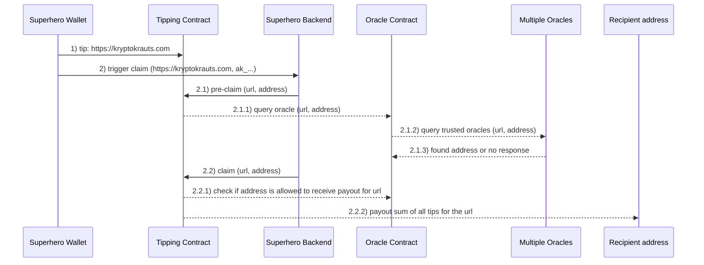

In may 2020 the æternity development community [announced the official launch](https://forum.aeternity.com/t/aepp-alert-tip-your-favorite-content-creators-and-causes-with-superhero/7092) of [**Superhero.com**](https://superhero.com) - a truly decentralized social tipping platform that can be used to support content creators and good causes instantly ***without any intermediary*** in between.

This means that no funds will be lost due to commissions and publishers do NOT need to proceed KYC in order to receive tips!

<a href="https://superhero.com" target="_blank"></a>

Sounds too good to be true? We can certainly say that there is absolutely no hidden downside! The source code of all components is [open sourced](#100-open-source) on GitHub.

## How does that work? What's going on behind the scenes?
A regular user won't notice much of the "magic" that is happening behind the scenes. But for all those interested we want to provide a deep dive on what's going on behind the scenes and explain why the [**æternity blockchain**](https://aeternity.com) is perfect to build a platform like Superhero upon.

### Step 1 - Superhero Wallet: Tip
The user decides to tip a URL by using the Superhero Wallet. In order to be able to perform a tip the user needs to have AE tokens to cover the tip amount as well as the (cheap) transaction fee.

When the user confirms this action the smart contract function [`tip`](https://github.com/aeternity/tipping-contract/blob/master/contracts/Tipping.aes#L78) is being executed and the tip is stored in the smart contract until it is claimed by the publisher that is eligible to do so.

Thanks to the [***ÆNS***](https://github.com/aeternity/protocol/blob/master/AENS.md) (æternity naming system) it is very easy to look up the address of the tipping contract. E.g. you can use [***ænalytics***](https://aenalytics.org/names/superhero.chain) to see the contract address where **superhero.chain** points to.



### Step 2 - Superhero Wallet: Trigger claim
A publisher (or eligible recipient) triggers a claim for the tips of a certain URL using the Superhero Wallet. In this case the official Superhero backend will perform the required actions on behalf of the user. This allows publishers to claim tips without the need to buy AE tokens.

***Note:***
- In order to be eligible the claimer needs to have the æternity address (ak_...) or the ÆNS name (*.chain) of the Superhero Wallet included in the html of the URL. We for instance included the ÆNS name in the head of our website:
  ```
  <meta name="aens-name" content="kryptokrauts.chain" data-react-helmet="true">
  ```
- In case of Twitter or GitHub profiles the recipient can add the æternity address (ak_...) or the ÆNS name (*.chain) to the biography.
- The following steps (in this case performed by the Superhero backend) can also be performed "manually" by ***any other user***. It is possible to claim the tips on behalf of other users by providing the address of the eligible user. This is actually also what the Superhero backend is doing. The Superhero Wallet provides the address of the user to the Superhero backend which then tries to claim the tips on behalf of the user.

#### Step 2.1 - Superhero Backend: Pre-claim
The Superhero backend receives the address of the Superhero Wallet as well as the current URL and calls the [`pre-claim`](https://github.com/aeternity/tipping-contract/blob/master/contracts/Tipping.aes#L105) function of the tipping contract providing this information.

##### Step 2.1.1 - Tipping Contract: Query oracle
The tipping contract calls the [`query_oracle`](https://github.com/aeternity/tipping-oracle-service/blob/master/contracts/OracleService.aes#L69) function of the oracle contract.

##### Step 2.1.2 - Oracle Contract: Query trusted oracles
The oracle contract which manages a list of trusted oracles performs the actual query for each of the minimum required amount of oracles.

##### Step 2.1.3 - Multiple Oracles: respond if address is found
Each of the trusted oracles runs a [service to poll queries](https://github.com/aeternity/tipping-oracle-service/blob/master/server/oracleService.js) and if requested performs a logic to determine whether the expected address is included in the html of the provided URL. The oracles only respond if the expected address is found.

#### Step 2.2 - Superhero Backend: Claim
This [action is only performed](https://github.com/aeternity/tipping-community-backend/blob/master/utils/aeternity.js#L155) when the [`check_claim`](https://github.com/aeternity/tipping-contract/blob/master/contracts/Tipping.aes#L141) function of the tipping contract succeeds. The [aepp-sdk-js](https://github.com/aeternity/aepp-sdk-js) which is used in the Superhero backend automatically performs a [***dry-run***](https://github.com/aeternity/protocol/blob/master/node/api/contract_api_usage.md#dry-run) call as the `check_claim` function isn't stateful.

This allows the Superhero backend to check if a pre-claim was successful without having to pay any fee to do so. The returned value of the `check_claim` function is of type [`success_claim`](https://github.com/aeternity/tipping-oracle-service/blob/master/contracts/OracleService.aes#L30) and contains the attributes `success (bool)`, `account (address)` and `percentage (int)`.

The logic to create the response value of type `success_claim` is performed in the oracle contract where the [oracle responses are being analyzed](https://github.com/aeternity/tipping-oracle-service/blob/master/contracts/OracleService.aes#L108).

The [`claim`](https://github.com/aeternity/tipping-contract/blob/master/contracts/Tipping.aes#L108) function of the tipping contract will only be performed if the dry-run call of the `check_claim` function returns a value where the attribute `success` is `true`.

##### Step 2.2.1 - Tipping Contract: check allowance
Before performing the actual payout the tipping contract needs to [ask the oracle contract whether the given address is allowed to receive the tips](https://github.com/aeternity/tipping-contract/blob/master/contracts/Tipping.aes#L157) within the `claim` function. 

The logic happening behind the scenes is similar to the logic that was previously triggered by the Superhero backend when `check_claim` was called. This time a "real transaction" will be executed as the `claim` function is stateful.

It is important to mention that the logic requires that >50% of the oracles to respond with the expected address. Otherwise the payout won't be executed!

##### Step 2.2.2 - Tipping Contract: payout
When the allowance check in the previous step is successful and the tip amount for the URL is greater than zero the the tipping contract will [perform the payout](https://github.com/aeternity/tipping-contract/blob/master/contracts/Tipping.aes#L114) and the address provided to the `claim` function will receive the tips.

## Superhero video explainer by Philipp Piwowarsky
`youtube: 70ns0U_jbUI`

## Typical questions
- Is this really free to use?
  - **YES**, it is!
- What is the difference to the tipping system of **Brave**?
  - Currently the tipping system in Brave is ***not truly decentralized***. The biggest problem here is that publishers need to create an account on Uphold and proceed KYC in order to receive the tips. These tips are then credited to their Uphold account on a monthly basis. The transactions are not traceable on the blockchain and thus we cannot be 100% sure that everything is going right. In ***Superhero*** instead the tips are sent to a smart contract on the æternity blockchain and immediately accessible/claimable by the publishers. This provides full transparency about what URLs have been tipped and what address received the tip if it has been claimed already.
  - ***Note***:
      - We are still big fans of the Brave browser. If you aren't using it yet you should read [this article](/log/brave-and-basic-attention-token). Brave and Superhero are complementary which means you can use both tipping systems to send and receive tips! ;-)
- Can I tip any public URL?
  - **YES**, you can tip any public URL.
- How can I participate?
  - Visit https://superhero.com and follow the tutorial.

## 100% Open Source
As already mentioned Superhero is 100% open source and available on GitHub. Check out the following repositories:
- https://github.com/aeternity/tipping-contract
  - contains the smart contract logic that covers the tipping related functionalities and holds all tips until they are claimed
- https://github.com/aeternity/tipping-oracle-service
  - contains the smart contract logic that manages oracles, handles oracle queries as well as oracle responses and checks if an address is eligible to claim tips for a certain URL
  - also contains the server logic for the oracles
- https://github.com/aeternity/tipping-community-backend
  - contains the backend logic to cover all actions within the Superhero platform
      - the claim-endpoint e.g. is being called by the Superhero Wallet to trigger the claim so that the enduser doesn't need to pay any transaction fee to claim tips
- https://github.com/aeternity/superhero-button
  - source code of the Superhero tipping button that can be embedded in your website
- https://github.com/aeternity/superhero-wallet
  - source code of the official Superhero wallet
- https://github.com/aeternity/superhero-ui
  - source code of https://superhero.com website

## Æternity - the blockchain for Superheroes!
The Superhero platform is built on top of æternity and it is the first decentralized æpp that demonstrates how some of æternitys powerful features can be utilized.

### Features used by the Superhero platform
The following features of æternity are used within the Superhero platform.

#### [ÆNS](https://github.com/aeternity/protocol/blob/master/AENS.md)
The æternity naming system can be used by publishers which can include the `*.chain` name on their website or on their social media profiles (e.g. Twitter or GitHub). A name can have unlimited pointers (with different keys) and following pointer keys are defined in the protocol:
- `account_pubkey`
- `contract_pubkey`
- `oracle_pubkey`
- `channel`

The naming system allows e.g. to send AE tokens directly to a name within a SpendTx. This only works if the `account_pubkey` is set and the protocol is able to determine the address to send the tokens to.

#### [Oracles](https://github.com/aeternity/protocol/blob/master/oracles/oracles.md)
In æternity oracles are first class citizens which means that they are built into the core protocol. There is no need for developers to develop contracts that define how oracle queries and responses should be handled. [Sophia](https://github.com/aeternity/aesophia) (æternitys smart contract language) [provides built-in methods](https://github.com/aeternity/aesophia/blob/lima/docs/sophia_stdlib.md#oracle) to register and/or communicate with oracles.

#### [Smart Contracts](https://github.com/aeternity/protocol/blob/master/contracts/contracts.md)
As already mentioned æternity introduced a new functional [OCaml](https://ocaml.org/) like smart contract language called [Sophia](https://github.com/aeternity/aesophia). The syntax of Sophia most resembles that of [Reason](https://reasonml.github.io/). Unlike most other smart contract blockchains æternity isn't using the EVM (Ethereum Virtual Machine) anymore and consideres the [AEVM](https://github.com/aeternity/protocol/blob/master/contracts/aevm.md) (modified EVM) as deprecated in the future.

`youtube: a77DGGzMyN8`

Instead [FATE](https://github.com/aeternity/protocol/blob/master/contracts/fate.md) was invented which is a type safe high-level virtual machine which contracts safe up to 90% storage compared to similar EVM contracts.

### Additional features (not explicitely used by the Superhero platform)
Æternity provides many other great features. We encourage everyone to check out the [website](https://aeternity.com) to learn more about æternity. In this article we want to highlight the answers of æternity to existing scalability issues.

#### [Bitcoin-NG](https://github.com/aeternity/protocol/blob/master/consensus/bitcoin-ng.md) (scaling on-chain)
Besides the features mentioned above æternity aims to solve existing scaling problems and was the first blockchain that implemented [Bitcoin-NG](https://github.com/aeternity/protocol/blob/master/consensus/bitcoin-ng.md) consensus protocol. The use of Bitcoin-NG makes it possible for æternity to perform up to ~116 transactions per second (on-chain).

#### [State channels](https://github.com/aeternity/protocol/tree/master/channels#state-channels) (scaling off-chain)
Another solution that was introduced to improve scalability are so called [state channels](https://github.com/aeternity/protocol/tree/master/channels#state-channels). The idea behind state channels is that two parties can open a channel where they deposit funds and after the channel is opened those parties can perform transactions in a secure and trustless manner without the need of a blockchain (off-chain).

`youtube: Q8QEcQ47vyY`

The blockchain will after a channel is opened only be used in following cases:
- to solve a dispute if one party tries to cheat
- to close the channel
- to deposit additional funds

The state channel functionality is probably the most powerful feature of æternity and of course this is also part of the core protocol. In Ethereum for example there exist many different projects that aim to provide state channel solutions by making use of smart contracts. In August 2019 several projects joined forces and announced the initiative [StateChannels.org](https://statechannels.org/standards/) to unify around a single standard.

Æeternity ships its own reference implementation of state channels with the core protocol. Of course there is still a lot work to do (e.g. to make state channel usable on mobile phones) but the foundation was laid and state channels can already be used!

## Give us some of your superpower! <div class="superhero-medium"></div>
If you like the article and already have the Superhero Wallet we would be happy if you leave us some of your superpower.

Thank you!